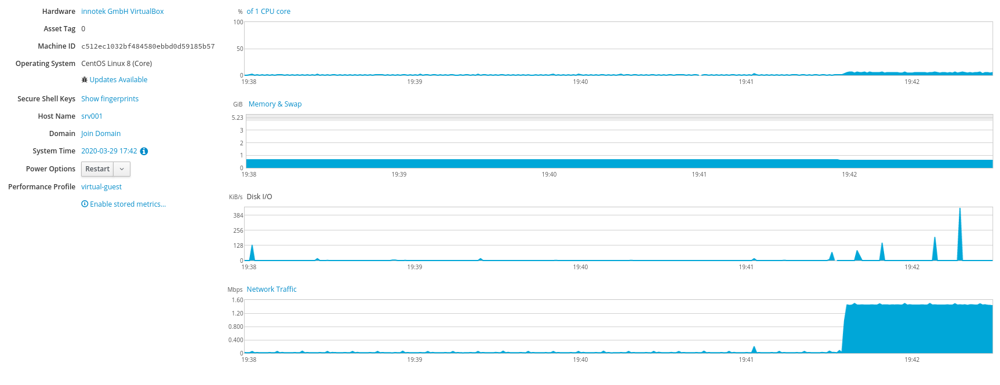

# Testplan taak 1: Lokale testomgeving

## Test 1: Kijken of Cockpit is geïnstalleerd

- Open een terminal
- Ga naar de plaats waar je vagrant file staat
- Voer het volgende commando in

> vagrant ssh

- Voer het volgende commando in

> ifconfig

- Bij 'eth1', neem het eerste ip adres na 'inet'
- Open een webbrowser
- Voer de volgende url in: *ip-adres*:9090
- Test resultaat positief:
  - De Cockpit inlogpagina verschijnt
- Test resultaat negatief
  - De Cockpit inlogpagina verschijnt

**Resultaat:** De inlogpagina van CentOS om in te loggen op server srv001 verschijnt :heavy_check_mark:

## Test 2: Load test uitvoeren

- Installeer httperf op je fysieke machine
- Open een terminal
- Voer het volgende commando in

> httperf --server 192.168.56.31 --port 80 --uri /drupal --rate 150 --num-conn 27000 --num-call 1 --timeout 5

- Open de Cockpit extensie
- Open de grafien van cpu, io, ram en netwerkgebruik
- Neem hiervan een screenshot voor en tijdens de test
- Kijk welke resource als het eerste is uitgeput en noteer dit op het testverslag

Load test wordt uitgevoerd. :heavy_check_mark:

Uit onderstaande afbeelding kunnen we afleiden dat het netwerk als eerste een bottleneck zal zijn. De loadtest werd gestart en onmiddelijk kwam er een hoge piek in het netwerkverkeer. 

Tester: Quinten De Bruyne

Auteur(s) testplan: Michiel Vanreybrouck
