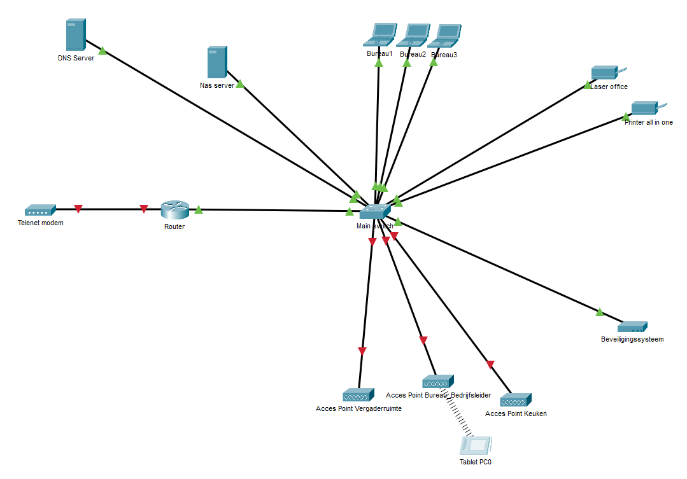

# Deel 1: Opzetten van de netwerktopologie
* 1 Telenet modem, 1 router, 1 Switch, 1 NAS Server, 1 DNS Server, 3 Acces Points, 1 beveiligingssysteem (generic wired divice), 1 tablet, 3 laptops en 2 printers plaatsen
* Alle toestellen verbinden zoals op het topologisch diagram.
  
 
# Deel 2: Configureer toestellen en verifiëer de connectiviteit
1. Bij de pc's, printers en servers, onder Config->Settings->Gateway/Dns IPv4 stel je de default gateway in.(192.168.0.1)
     Onder Config->FastEthernet0->IP Configuration kan je het IP adres instellen. 
	ip addressen-tabel
  
  | Naam        | ip-address           | 
| ------------- |:-------------:| 
| DNS-server      | 192.168.0.111     |
| NAS-server | 192.168.0.100 |
| PC's | 192.168.0.5,6,7 |
| Printers | 192.168.0.105,106 | 
| Security | 192.168.0.110 |

2. Acces points configuratie. Bij elk access point ga naar Config-> Port1 en verander de SSID naar "immo_bocha". Verander ook de authenticatie naar "WPA2-PSK" en stel een wachtwoord in ("bochaGast")
	Bij de tablet ga je nu ook naar Config-> Wireless0 en voer de correcte SSID (immo_bocha") en wachtwoord in (kies hier ook weer voor "WPA2-PSK")

3. Router Configureren


```
enable
conf t
hostname R1
no ip domain-lookup
enable secret class
line console 0
password cisco
login
line vty 0 4
password cisco
login
exit
service password-encryption
banner motd #Unuathorised access prohibited#
copy running-config startup-config
```

**Interfaces Configureren**

```
> R1(config)#int g0/0
> R1(config-if)#description Connection to Main Switch.
> R1(config-if)#ip address 192.168.0.2 255.255.255.0
> R1(config-if)#no shutdown
> R1(config-if)#exit
> R1(config)#exit
> R1# copy running-config startup-config
```

4. DHCP configureren op de router. 

```
> R1#conf t
> R1(config)#ip dhcp excluded-address 192.168.0.1 192.168.0.115
> R1(config)#ip dhcp pool POOL1
> R1(dhcp-config)#network 192.168.0.0 255.255.255.0
> R1(dhcp-config)#default-router 192.168.0.2
> R1(dhcp-config)#dns-server 192.168.0.111
```

5. Switch Configuratie.
  
```
enable
conf t
hostname MainSwitch
enable secret class
line console 0
password cisco
login
line vty 0 4
password cisco
login
exit
service password-encryption
banner motd #Unuathorised access prohibited#
ip default-gateway 192.168.0.1
copy running-config startup-config
```

6. VLAN's op de switch

  
```
enable
conf t
vlan 1
ip address 192.168.0.254 255.255.255.0 
no shutdown
vlan 10
name Bureaus
vlan 20
name Security
exit
```

7. Poorten toevoegen aan vlans

```
enable
conf t
interface range *voeg hier zelf de juiste poorten in. Dus de poorten waar de NAS, de printers en de laptops inzitten*
switchport mode access
switchport acces vlan 10
end
interface vlan *Voeg hier de poort in waar het beveiligingssysteem in zit*
switchport mode access
switchport acces vlan 20
```