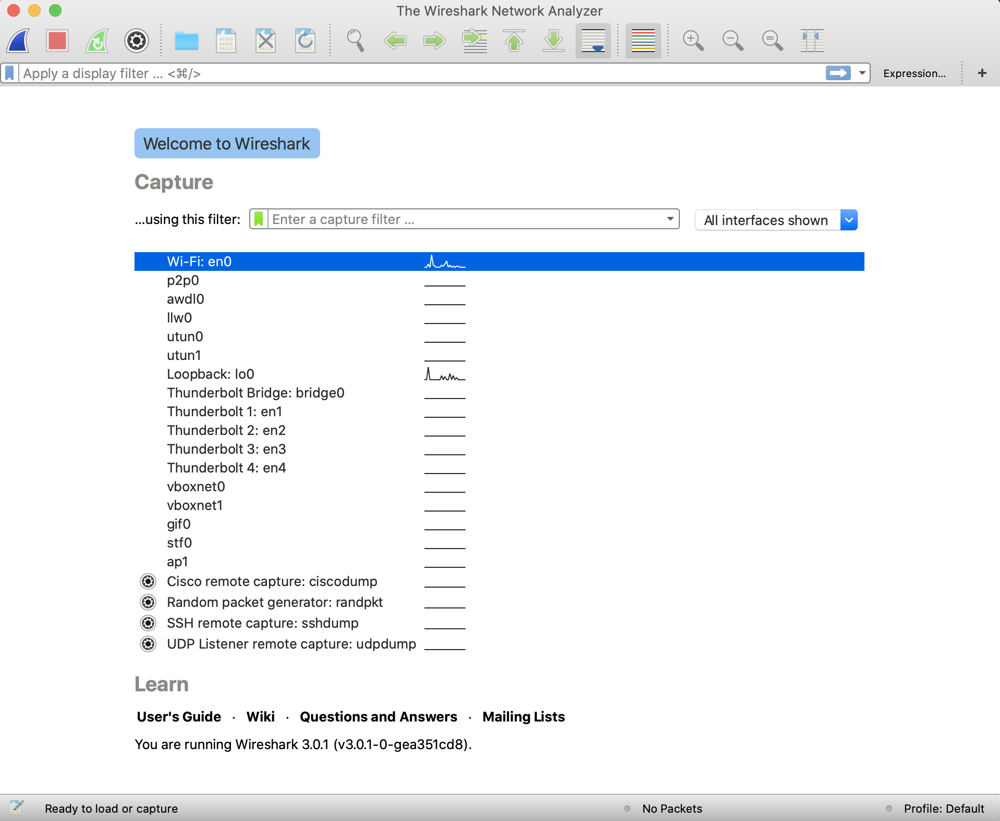
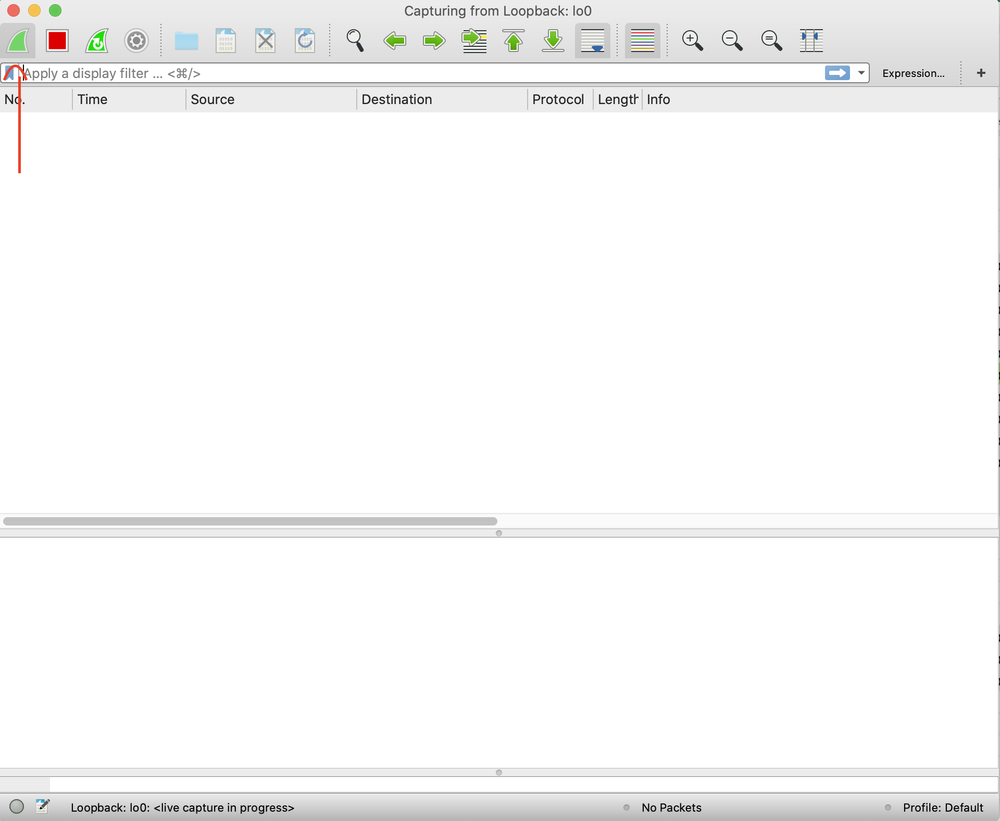

# Technische documentatie: uitvoeren van de aanval

## XSS (Cross-Site-Scripting) aanval (POST)

- Start VirtualBox op.
- Verander de netwerkinstellingen van de BeeBox van een NAT-adapter naar een bridged adapter.
- Start de BeeBox op.
- Wanner de BeeBox is opgestart, open een terminal.
- Typ in de terminal het volgende commando in:

> ifconfig

- De output zou er als volgt moeten uitzien:

```bash
eth0      Link encap:Ethernet  HWaddr 09:00:12:90:e3:e5
          inet addr:192.168.1.29 Bcast:192.168.1.255  Mask:255.255.255.0
          inet6 addr: fe80::a00:27ff:fe70:e3f5/64 Scope:Link
          UP BROADCAST RUNNING MULTICAST  MTU:1500  Metric:1
          RX packets:54071 errors:1 dropped:0 overruns:0 frame:0
          TX packets:48515 errors:0 dropped:0 overruns:0 carrier:0
          collisions:0 txqueuelen:1000
          RX bytes:22009423 (20.9 MiB)  TX bytes:25690847 (24.5 MiB)
          Interrupt:10 Base address:0xd020
lo        Link encap:Local Loopback
          inet addr:127.0.0.1  Mask:255.0.0.0
          inet6 addr: ::1/128 Scope:Host
          UP LOOPBACK RUNNING  MTU:16436  Metric:1
          RX packets:83 errors:0 dropped:0 overruns:0 frame:0
          TX packets:83 errors:0 dropped:0 overruns:0 carrier:0
          collisions:0 txqueuelen:0
          RX bytes:7766 (7.5 KiB)  TX bytes:7766 (7.5 KiB)
```

- Open nu een webbrowser.
- Voer het ip-adres in van de BeeBox, dit zijn de getallen na "inet addr:" van de eth0 interface.
- Wanneer dit geladen is, selecteer bWAPP.
- Log in met bee als gebruikersnaam, en bug als wachtwoord.
- Selecteer in het kader bij "A3 - Cross-Site Scripting (XSS)", Cross-Site Scripting - Reflected (POST).
- Voer bij firstname het volgende in:

```html
<b>**naam**<\b></b>
```

- Voer bij lastname je achternaam in.
- Druk op go.
- Nu zou je voornaam in het vet onder go moeten staan.
- Wanneer dit gebeurt is kunnen we hier nog verder in gaan met volgende commando's:

```html
<script>alert(document.cookie)<\script>
<script>alert(document.location)<\script>
<script>alert(document.domain)<\script>
```

## Denial-of-Service (Large Chunk Size)

- Start VirtualBox op.
- Verander de netwerkinstellingen van de BeeBox van een NAT-adapter naar een bridged adapter.
- Start de BeeBox op.
- Wanner de BeeBox is opgestart, open een terminal.
- Typ in de terminal het volgende commando in:

> ifconfig

- De output zou er als volgt moeten uitzien:

```bash
eth0      Link encap:Ethernet  HWaddr 09:00:12:90:e3:e5
          inet addr:192.168.1.29 Bcast:192.168.1.255  Mask:255.255.255.0
          inet6 addr: fe80::a00:27ff:fe70:e3f5/64 Scope:Link
          UP BROADCAST RUNNING MULTICAST  MTU:1500  Metric:1
          RX packets:54071 errors:1 dropped:0 overruns:0 frame:0
          TX packets:48515 errors:0 dropped:0 overruns:0 carrier:0
          collisions:0 txqueuelen:1000
          RX bytes:22009423 (20.9 MiB)  TX bytes:25690847 (24.5 MiB)
          Interrupt:10 Base address:0xd020
lo        Link encap:Local Loopback
          inet addr:127.0.0.1  Mask:255.0.0.0
          inet6 addr: ::1/128 Scope:Host
          UP LOOPBACK RUNNING  MTU:16436  Metric:1
          RX packets:83 errors:0 dropped:0 overruns:0 frame:0
          TX packets:83 errors:0 dropped:0 overruns:0 carrier:0
          collisions:0 txqueuelen:0
          RX bytes:7766 (7.5 KiB)  TX bytes:7766 (7.5 KiB)
```

- Open nu een webbrowser.
- Voer het ip-adres in van de BeeBox, dit zijn de getallen na "inet addr:" van de eth0 interface.
- Wanneer dit geladen is, selecteer bWAPP.
- Log in met bee als gebruikersnaam, en bug als wachtwoord.
- Selecteer in het kader bij "A5 - Security Misconfiguration", Denial-of-Service (Large Chunk Size).
- Open een terminal op je computer.
- Navigeer naar de map "Scripts".
- Run dan het volgende commando:

```bash
python3 large_chunk.py *ip-adres*:8080
```

- Kijk nu of je webpagina nog responsief is, zo niet is de aanval gelukt.

## Clear text http

- Start VirtualBox op.
- Verander de netwerkinstellingen van de BeeBox van een NAT-adapter naar een bridged adapter.
- Start de BeeBox op.
- Wanner de BeeBox is opgestart, open een terminal.
- Typ in de terminal het volgende commando in:

> ifconfig

- De output zou er als volgt moeten uitzien:

```bash
eth0      Link encap:Ethernet  HWaddr 09:00:12:90:e3:e5
          inet addr:192.168.1.29 Bcast:192.168.1.255  Mask:255.255.255.0
          inet6 addr: fe80::a00:27ff:fe70:e3f5/64 Scope:Link
          UP BROADCAST RUNNING MULTICAST  MTU:1500  Metric:1
          RX packets:54071 errors:1 dropped:0 overruns:0 frame:0
          TX packets:48515 errors:0 dropped:0 overruns:0 carrier:0
          collisions:0 txqueuelen:1000
          RX bytes:22009423 (20.9 MiB)  TX bytes:25690847 (24.5 MiB)
          Interrupt:10 Base address:0xd020
lo        Link encap:Local Loopback
          inet addr:127.0.0.1  Mask:255.0.0.0
          inet6 addr: ::1/128 Scope:Host
          UP LOOPBACK RUNNING  MTU:16436  Metric:1
          RX packets:83 errors:0 dropped:0 overruns:0 frame:0
          TX packets:83 errors:0 dropped:0 overruns:0 carrier:0
          collisions:0 txqueuelen:0
          RX bytes:7766 (7.5 KiB)  TX bytes:7766 (7.5 KiB)
```

- Open nu een webbrowser.
- Voer het ip-adres in van de BeeBox, dit zijn de getallen na "inet addr:" van de eth0 interface.
- Wanneer dit geladen is, selecteer bWAPP.
- Log in met bee als gebruikersnaam, en bug als wachtwoord.
- Selecteer in het kader bij "A6 - Sensitive Data Exposure", Clear Text HTTP (Credentials).
- Open wireshark op je computer, nu krijg je volgende scherm te zien:



- Selecteer "WIFI"
- Druk nu op de startknop links bovenaan.



- Vul nu in je browser:

>login: bee
>password: bug

- Druk op login.
- Stop nu het verzamelen van data in wireshark door op de knop rechts van de startknop te duwen.
- Voeg nu bovenaan een displayfilter toe: "http".
- Zoek bij de info naar een "POST".
- Klik op het volgend:

>HTML Form URL Encoded: application/x-www-form-urlencoded

- Nu kan je de data bekijken die is verstuurd.
