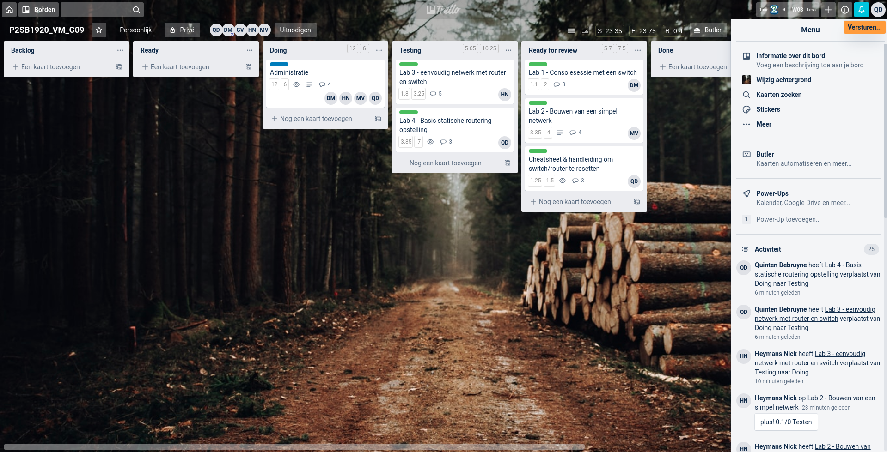
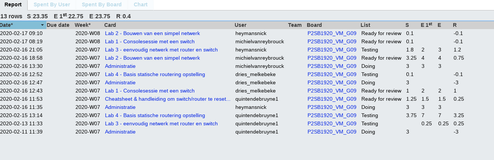
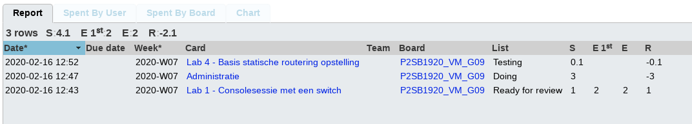
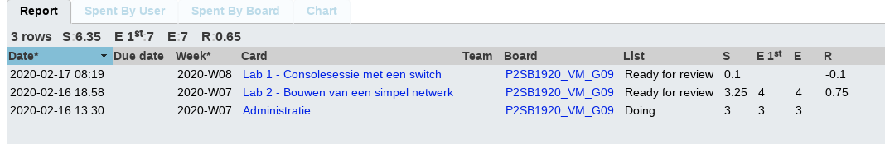
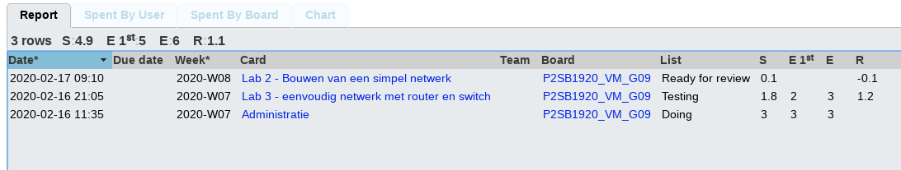
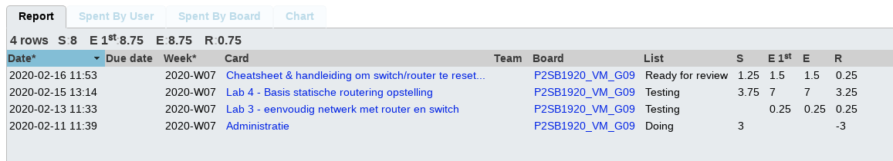

# Voortgangsrapport week 2

* Groep: 9
* Datum voortgangsgesprek: N/A

| Student  | Aanw. | Opmerking |
| :---     | :---  | :---      |
| Nick |  Ja     |           |
| Dries |   Ja    |           |
| Michiel |   Ja    |           |
| Quinten |    Ja   |           |

## Wat heb je deze week gerealiseerd?

### Algemeen

* Alle labo's van opdracht 1: packettracer, testplannen, testverslagen 

### Dries

* labo 1: packettracer, testverslag
* Testen labo 4

### Michiel

* labo 2: packettracer, testverslag
* Testen labo 1

### Nick

* Labo 3: packettracer, testverslag
* Testen labo2

### Quinten De Bruyne

* Labo4
* Testen labo3
* Cheatsheet en reset switch/router

## Wat plan je volgende week te doen?

### Algemeen
* Fysieke opstellingen opdracht1
* Starten opdracht 2
### Dries
### Michiel
### Nick
### Quinten

## Waar hebben jullie nog problemen mee?

## Feedback technisch luik

### Algemeen

**Algemeen:**

- Goede start van het project
- Al veel informatie op Github te vinden, duidelijke, aantoonbare neerslag van het geleverde werk
- Leer nog wat beter werken met Markdown
- Kunnen via Trello overzicht geven van tijdbesteding: schatting vs gepresteerde uren
- Demo's verlopen vlot

**Deelopdracht 1:**

- Alle labo's uitgewerkt in PacketTracer
- Bezig met labo 3 fysiek
    - Apparaat moeten resetten (wachtwoord ingesteld)
- Handleidingen, cheat sheet op Github beschikbaar
- Demo gegeven van labo's 1, 2, 3 en 4

**Deelopdracht 2:**

- Nog niet mee begonnen - het is aanbevolen om vandaag al lastenboek op te stellen. Volgende week is er geen contactmoment, dus jullie zouden tijd verliezen als het werk nu nog niet verdeeld is.

### Dries
### Michiel
### Nick
### Quinten

## Feedback analyseluik

### Algemeen

