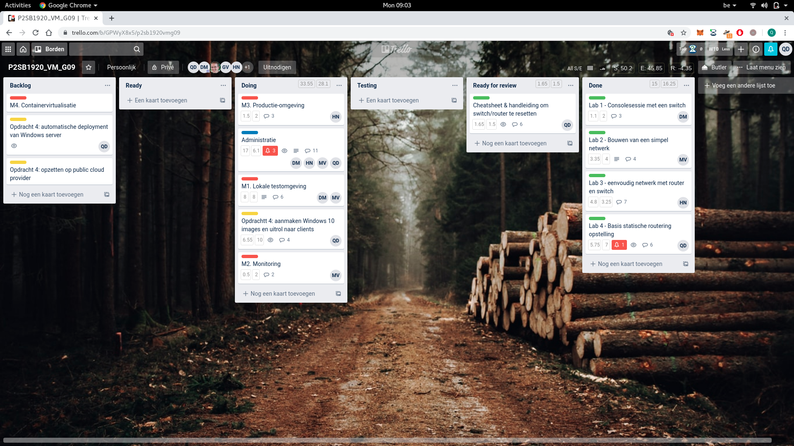
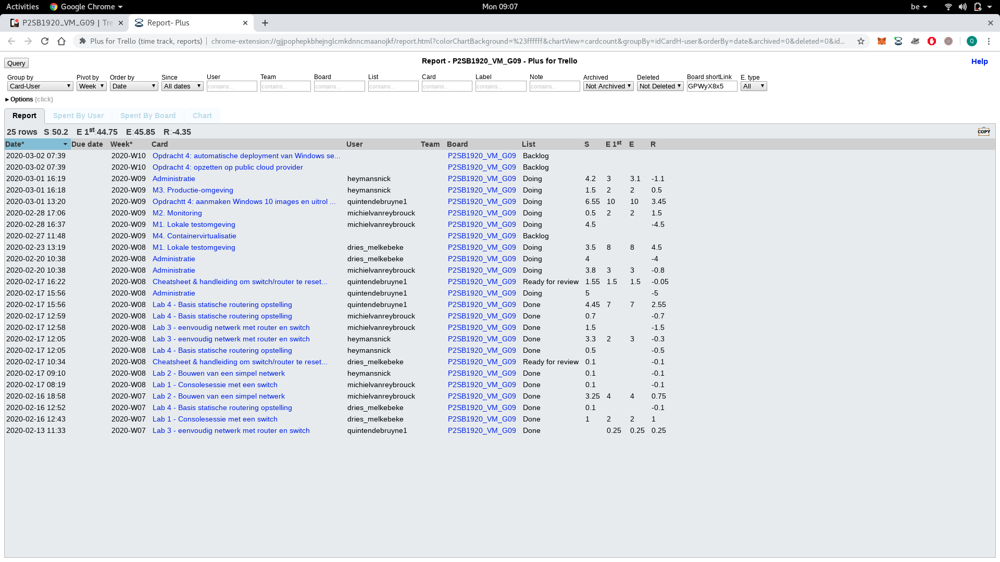
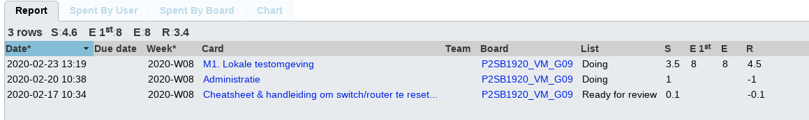
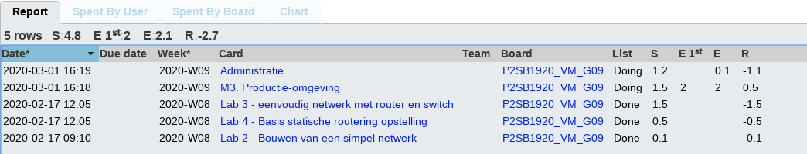
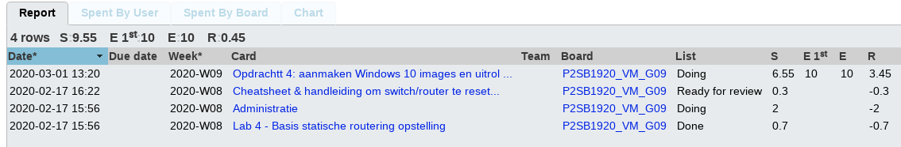
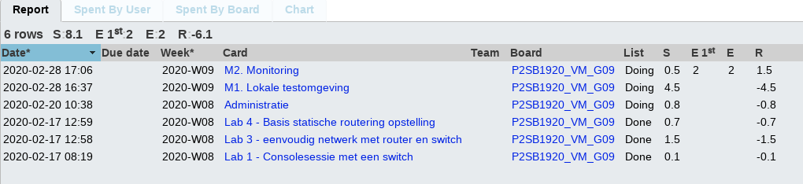
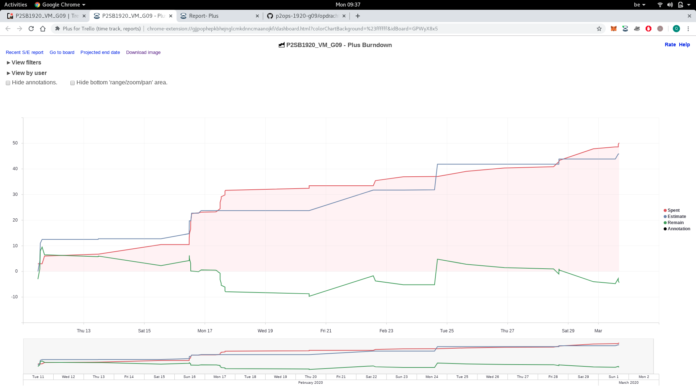

# Voortgangsrapport week 4

* Groep:g09
* Datum voortgangsgesprek:02/03/2020

| Student  | Aanw. | Opmerking |
| :---     | :---  | :---      |
| Dries | V     |           |
| Nick | V     |           |
| Quinten | V     |           |
| Michiel | V     |           |

## Wat heb je deze week gerealiseerd?
- Dries: Opdracht 2 deel 1
- Nick: Gestart met Opdracht 2 deel 3
- Quinten: Gestart met Opdracht 4
- Michiel: Opdracht 2 deel 1 & 2
### Algemeen

* Begonnen opdracht 4
* Opdracht 2: M1, M2 en M3 ver gevorderd

### Dries

* Opdracht 2: M1 Lokale testomgeving
* Fysiek opstellen opdracht 1

### Nick

* Opdracht 2: M3 productie omgeving
* Fysiek opstellen opdracht 1

### Quinten

* Creëren van Windows 10 image met Microsoft Deployment toolkit
* Deployen van clients op VM.
* Fysiek opstellen opdracht 1

### Michiel

* Opdracht 2 M1 Testomgeving
* Opdracht 2 M2 Monitoring
* Fysiek opstellen opdracht 1

### Burndown

## Wat plan je volgende week te doen?

### Algemeen
* Opdracht 2 volledig afgewerkt en getest
* Verder werken opdracht 4 (verslag creëren Windows 10 image & deployen ervan in testomgeving)
### Dries
* Opdracht 2 afwerken
* Testen opdracht 2 M1 & M2 & M3
### Nick
* Opdracht 2 afwerken M3
* Schrijven testplan M3
### Quinten
* Opdracht 4: schrijven verslag Windows 10 image creëren en deployen
* Opdracht 4: starten met automatisch opzetten Windows server 
* Opdracht 4: schrijven testplan over Windows 10 image creëeren en deployen met mdt.
### Michiel
* Opdracht 2: afwerken M1 & M2
* Opdracht 2: schrijven testplan M1 & M2
### Nog te verdelen 
* Opdracht 2 M4

## Waar hebben jullie nog problemen mee?

* Nick: AWS geeft geen optie om een account aan te maken via de hogent / Azure wilt de Vragrant box niet aannemen.

## Feedback technisch luik

### Algemeen

- Opdracht 2 en 4 zit al uitgebreid in de planning: prima

**Opdracht 1 (Cisco)**

- Resetprocedure: wat als router/switch beschermd is met een onbekend wachtwoord?

**Opdracht 2 (LAMP)**

- Lokale LAMP stack is operationeel
    - Script opgedeeld in functies met descriptieve namen
    - Cockpit operationeel
    - Apache werkt
    - Drupal geïnstalleerd, kan database gebruiken
    - Rekening gehouden met SELinux
- Mogelijkheden van Azure aan het verkennen voor deployment in cloud-omgevin
    - Kan je Bento-boxes in Azure opzetten? -> nee, die zijn specifiek voor VirtualBox. Je kan op Azure normaal wel een basisinstallatie van CentOS 8 opstarten en daarmee kan je verder.

**Opdracht 4 (MDT)**

- Image om te deployen aangemaakt
- WS is nu manueel opgezet (is 1e stap in automatiseren)

### Dries
### Nick
### Quinten
### Michiel

## Feedback analyseluik

### Algemeen

### Dries
### Nick
### Quinten
### Michiel
