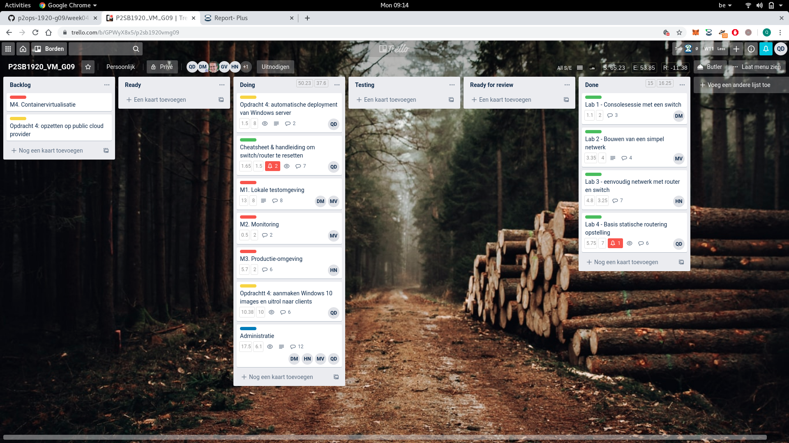
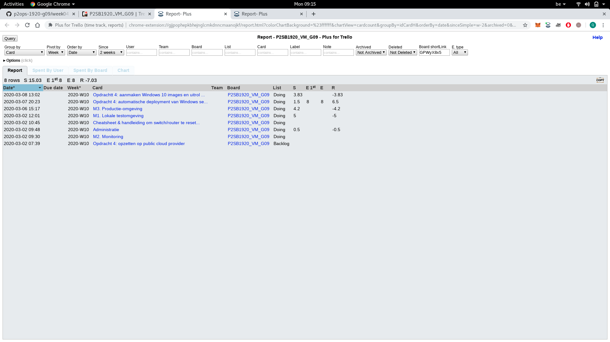
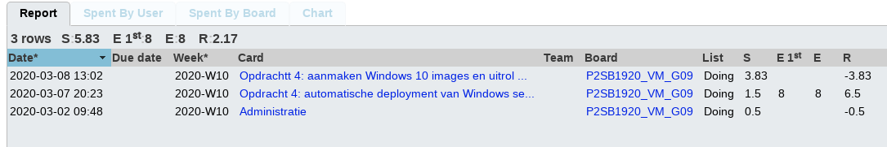

# Voortgangsrapport week 4

* Groep:g09
* Datum voortgangsgesprek:09/03/2020

| Student  | Aanw. | Opmerking |
| :---     | :---  | :---      |
| Dries |     |           |
| Nick |     |           |
| Quinten | V     |           |
| Michiel |     |           |

## Wat heb je deze week gerealiseerd?
- Dries: Opdracht 2.1-2.2 code cleanup
- Nick: Opdracht 2.3
- Quinten: Opdracht 4 gedeeltelijk
- Michiel: Testverslag maken 2.1-2.2 + code cleanup (gedeeltelijk)
### Algemeen

* Verder gewerkt opdracht 4
* Opdracht 2: M1, M2 en M3 ver gevorderd

### Dries

* Code cleanup

### Nick

* Opdracht 2: M3 productie omgeving, productie script gemaakt en stappenplan uitgeschreven

### Quinten

* Verslag opdracht 4 over creëeren Windows 10 image en deployen
* Automatiseren deployen Windows Server virtualbox: opzoekingswerk

### Michiel

* Testplan gemaakt 2.1-2.2 gedeeltelijk

## Wat plan je volgende week te doen?

### Algemeen
* Verder werken aan opdracht 2 en 4
### Dries
* Verder afwerken scripts 2.1-2.2
### Nick
* opdracht 2.3: script testen 
### Quinten
* Opdracht 4: schrijven verslag Windows 10 image creëren en deployen
* Opdracht 4: starten met automatisch opzetten Windows server 
* Opdracht 4: schrijven testplan over Windows 10 image creëeren en deployen met mdt.
### Michiel
* Opdaracht 2.1-2.2: verder alle testen maken

## Waar hebben jullie nog problemen mee?
*

## Feedback technisch luik

### Algemeen

- Opdracht 2 en 4 zit al uitgebreid in de planning: prima

**Opdracht 1 (Cisco)**

- Resetprocedure: wat als router/switch beschermd is met een onbekend wachtwoord?

**Opdracht 2 (LAMP)**

- Lokale LAMP stack is operationeel
    - Script opgedeeld in functies met descriptieve namen
    - Cockpit operationeel
    - Apache werkt
    - Drupal geïnstalleerd, kan database gebruiken
    - Rekening gehouden met SELinux
- Mogelijkheden van Azure aan het verkennen voor deployment in cloud-omgevin
    - Kan je Bento-boxes in Azure opzetten? -> nee, die zijn specifiek voor VirtualBox. Je kan op Azure normaal wel een basisinstallatie van CentOS 8 opstarten en daarmee kan je verder.

**Opdracht 4 (MDT)**

- Image om te deployen aangemaakt
- WS is nu manueel opgezet (is 1e stap in automatiseren)

### Dries
### Nick
### Quinten
### Michiel

## Feedback analyseluik

### Algemeen

### Dries
### Nick
### Quinten
### Michiel
