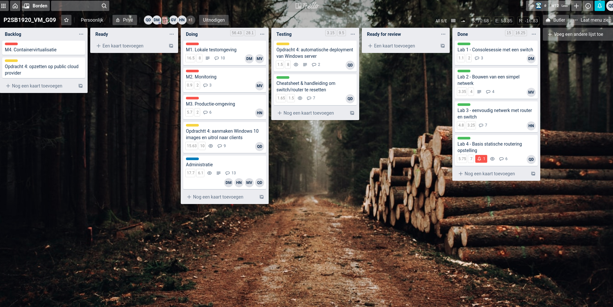
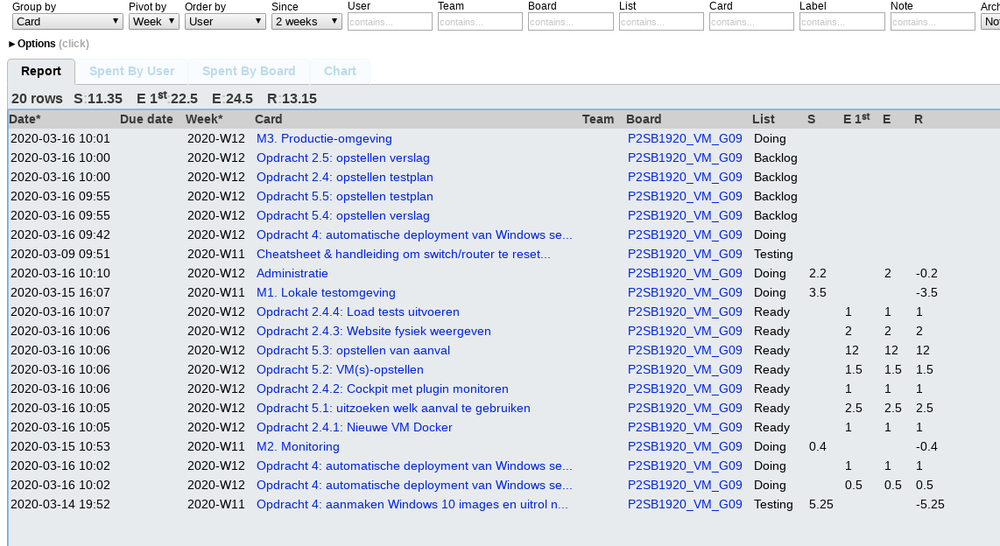
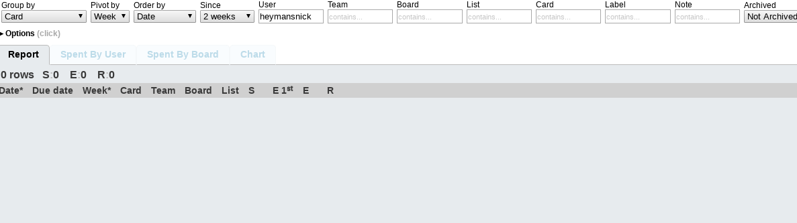
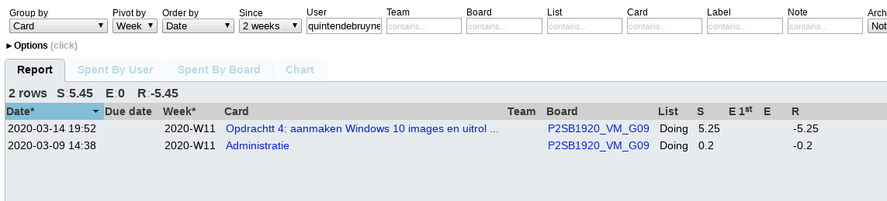
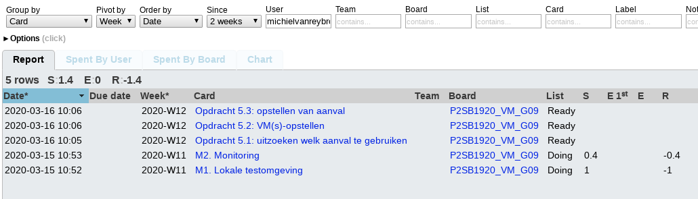
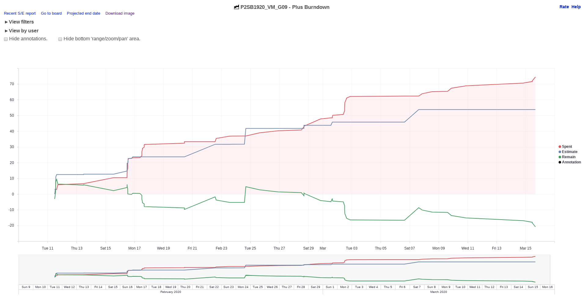

# Voortgangsrapport week 06

* Groep:09
* Datum voortgangsgesprek: 16/03/2020

| Student  | Aanw. | Opmerking |
| :---     | :---  | :---      |
| Dies |  V     |           |
| Nick |  V     |           |
| Quinten |  V     |           |
| Michiel |  V     |           |

## Wat heb je deze week gerealiseerd?

### Algemeen

* Opdracht 4: capture en deploy client image (verslag afgewerkt, klaar om te testen)
* Configfile voor opdracht 2.1
* Stresstesten opdracht 2 uitproberen
* Verslagen opdracht 2.1 & 2.2, testverslag 2.1

### Dries

* Configfile gecreëerd die user zelf naam en wachtwoord databases laat instellen. 
* testplan 2.1 aangepast voor config

### Nick

* Proberen stresstest(nog niet gelukt)

### Quinten

* Afgewerkt automatische uitrol van clients met applicaties geïnstalleerd en laatste windows updates.

### Michiel

* Afgewerkte testverslag + verslag 2.1, afgewerkt verslag 2.2 + deels testverslag

### Burndown

## Wat plan je volgende week te doen?
* Opdracht 2.4: VM docker met cockpit, website fysiek weergeven, load tests uitvoeren.
* Opdracht 4: client deployment getest & tonen PoC
* Opdracht 4: uitwerken automatisatie Windows server, schrijven verslag en testplan
* Opdracht 5: verkennen mogelijkheden, vm's opstellen, opstellen aanval.

### Algemeen

### Dries: 
* Opdracht 2.4
* Opdracht 2.1 cleanup
* Opdracht 2 testplannen en verslagen

### Nick:
* 2.3 Afwerken
### Quinten
* Automatische opzet Windows Server volledige afgewerkt.
### Michiel
* Beginnen aan opdracht 5 + opdracht 2 testing

## Waar hebben jullie nog problemen mee?

* ...
* ...

## Feedback technisch luik

Vooruitgang sinds vorige contactmoment is moeilijk op te maken uit verslaggeving (weekrapport, Trello). Dit wordt extra belangrijk de komende weken, dus steek hier voldoende tijd in!

**Opdracht 2**

- Load test: hoeft niet op Azure, vergelijk evt. Vagrant/Virtualbox vs Docker

**Opdracht 4**

- Windows 10 desktop deployment is klaar om getest te worden

**Opdracht 5**

- Wordt deze week opgestart 

## Feedback analyseluik

### Algemeen

### Dries
### Nick
### Quinten
### Michiel
