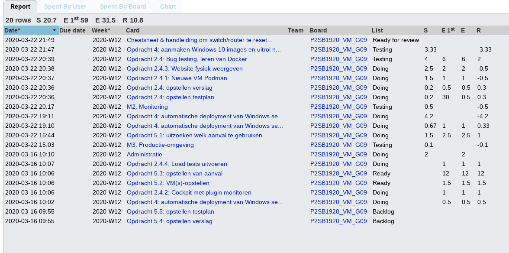
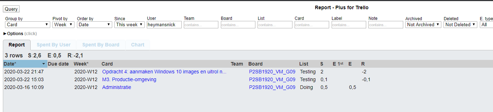
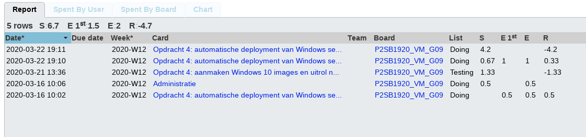
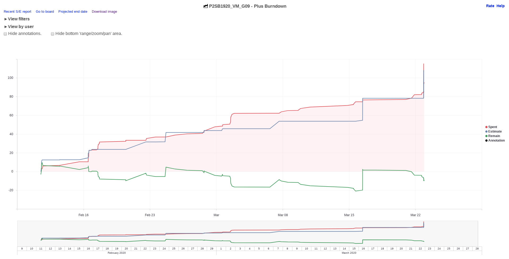

# Voortgangsrapport week 07

* Groep:09
* Datum voortgangsgesprek: 23/03/2020

| Student  | Aanw. | Opmerking |
| :---     | :---  | :---      |
| Dries |  V     |           |
| Nick |  V     |           |
| Quinten |  V     |           |
| Michiel |  V     |           |

## Wat heb je deze week gerealiseerd?

### Algemeen


* Opdracht 2.4: Dockeromgeving is bijna afgewerkt
* Opdracht 2.4: Testplan en verslag aangemaakt en aangevuld
* Opdracht 4: Windows Server deploy



### Dries

* Leren van Docker & Podman via zowel Fedora31 als CentOS8
* Opstelling van Docker volgens opdracht (Enkel load testing te gaan)
* Opstelling van verslag
* Opstelling van testplan


### Nick

* 2.3 Testplan geschreven
* Opdracht 4 "Windows 10 uitrol naar clients gebruikmakende van Windows Deployment Services" getest



### Quinten

* Opdracht 4: Windows server uitrol via mdt (testomgeving + verslag)



### Michiel

* Opdracht 5: kijken welke aanvallen te gebruiken + informatie
* Opdracht 2.2: loadtest uitzoeken


### Burndown


## Wat plan je volgende week te doen?

### Algemeen
### Dries
* Afwerken opdracht 2.4, testplannen afwerken, start opdracht vastgoedstudenten

### Nick
* Opdracht 4 verder testen, helpen met opdracht 2.4, Start opdracht vastgoedstudenten.
### Quinten
* Verbeteren tesplan opdracht 4 uitrol client
* Afwerken verslag opdracht 4 uitrol server
* Opstellen testplan opdracht 4 uitrol server
* Starten met opdracht 4 op public provider
### Michiel
* Beginnen met VM's opstellen voor opdracht 5 en opdracht 5 verder uitwerken. Start opdracht vastgoedstudenten.

## Waar hebben jullie nog problemen mee?

* Welke aanval te gebruiken? 
* Loadtest installeren lukt niet.
* Testplan voor opdracht 4 uitrol client moet aangepast worden.

## Feedback technisch luik

### Algemeen

- Goed gevorderd, keep up the good work!
- Hou Trello-bord in de gaten!

** Deelopdracht 2**

- Demo load test getoond in Docker-opstelling, statische webpagina en
- Tip: aantal cpus/geheugen vergroten in `vagrant-hosts.yml`

```yml
- name: srv001
  ip: 192.168.56.31
  memory: 4096
  cpus: 4
```

- Installeer httperf op fysiek systeem ([Windows](https://www.itefix.net/httperf)/Mac Homebrew)

**Deelopdracht 5**

- Welk soort aanval is aanvaardbaar? Gekeken naar: Keylogger, smurf, MitM, XSS, SQL injection, drive-by
    - Allemaal goed!

## Feedback analyseluik

### Algemeen
