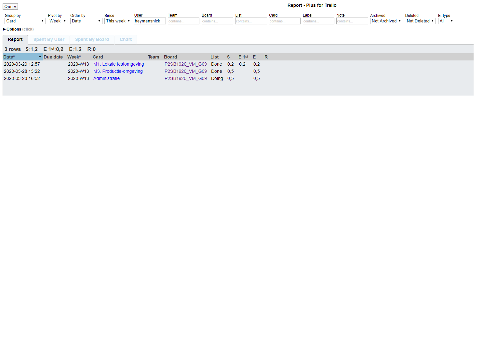

# Voortgangsrapport week 08

* Groep:09
* Datum voortgangsgesprek:

| Student  | Aanw. | Opmerking |
| :---     | :---  | :---      |
| Dries |  V     |           |
| Nick |   V    |           |
| Quinten |  V     |           |
| Michiel |  V     |           |

## Wat heb je deze week gerealiseerd?

### Algemeen

* Opdracht 2 afgewerkt en getest
* Opdracht 4 verder gevorderd

### Dries

* Opdracht 2 testplan
* Opdracht 2 verslag
* Opdracht 2 cheatsheet
* Opdracht 2 gebruikersdocumentatie
* Opdracht 2.3 Testing

### Nick

* Opdracht 2.1 getest
* Opdracht 2.3 mee helpen testen
* Oprdacht 4: uitrol client getest

### Quinten

* Testen 2.2
* Testen 2.4
* Bijwerken testplannen testomgeving opdracht 4
* Gestart opzoekingen opdracht 4 public cloud providers

### Michiel

* Opzetten VM's opdracht 5
* Kiezen aanval
* Testverslag aanpassen 2.2

## Wat plan je volgende week te doen?

### Algemeen
### Dries
* Opdracht 3 planning + analyse
### Nick
* Verder testen van opdracht 4
* Beginnen aan opdracht 5
### Quinten
* Verder werken opdracht 4 productieomgeving
* Opdracht 3 starten
### Michiel
* Opdracht 5 verder aan werken (VM's + aanval opstellen)

## Waar hebben jullie nog problemen mee?

* Testen van opdracht 4: uitrol client nog niet volledig gelukt(problemen bij laatste stap)
* ...

## Feedback technisch luik

### Oplevering deelopdracht 2

- Milestone 1: lokale opstelling
    - [x] `vagrant up` => werkende VM (PHP site met DB zichtbaar in browser)
    - [x] Script is configureerbaar (geen hard-coded gebruikersnamen/wachtwoorden; settings in variabelen/apart bestand)
    - [x] Oog voor beveiliging (SELinx, firewall)
- Milestone 2: Monitoriung
    - [x] Monitoringsysteem geïnstalleerd (Cockpit)
    - [ ] Load test uitgevoerd, resultaten geïnterpreteerd
- Milestone 3: Productie-omgeving
    - [ ] Na uitvoer installatie-script is website beschikbaar voor gebruikers
- Milestone 4: Containervirtualisatie
    - [x] `vagrant up` => website beschikbaar voor gebruikers
- Documentatie: goed uitgewerkt, duidelijk gestructureerd
    - [x] Gebruikersdocumentatie
    - [x] Testplan en -rapport:

- Goed voorbereide demo, en door de duidelijke structuur van de repo is info makkelijk terug te vinden als die nodig was.
- M2: Load test getoond, maar lijkt geen load te veroorzaken op de VM?
- M3: Op Azure niet geslaagd om een webserver beschikbaar te maken voor gebruikers. Blijkbaar is dat niet mogelijk binnen het studenten-account. Het script draait wel, maar website is dus niet bereikbaar...
- M4: prima

## Feedback analyseluik

### Algemeen

### Dries
### Nick
### Quinten
### Michiel

