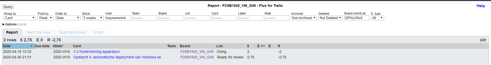
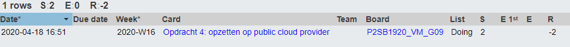

# Voortgangsrapport weken paasvakantie

* Groep:09
* Datum voortgangsgesprek: 20/04/2020

| Student  | Aanw. | Opmerking |
| :---     | :---  | :---      |
| Dries |   -    | afwezig          |
| Nick |    V   |           |
| Quinten |   V    |           |
| Michiel |   V    |           |

## Wat heb je deze weken gerealiseerd?

### Algemeen

* Opdracht 3 analyse van vastgoed aanvraag
* Opdracht 3 contact met studenten vastgoed via mail
* Opdracht 3 contact met studenten vastgoed via teams gesprek voor vragen
* Opdracht 3 offerte opmaak (zowel goedkoop als dure offerte)

[Afbeelding teamoverzicht tijdregistratie onderverdeeld per deelopdracht]

### Dries

* Contactmoment met studentenvastgoed teams

### Nick

* Contactmoment met studentenvastgoed teams
* Kostenraming apparatuur

### Quinten

* Opdracht 4 public cloud provider (Azure).

### Michiel

* Contactmoment met vastgoed team + mails
* Kostenraming apparatuur

## Wat plan je volgende week te doen?

### Algemeen
* Opdracht 3 offerte finaliseren
* Opdracht 3 opdracht implementeren in packet tracer
* Contact met vastgoedstudenten om offerte te bespreken
* Opdracht 4 uitrol client testen

### Dries
* Offerte finaliseren + implementatie

### Nick
* Opdracht 4 uitrol client testen
* Opdracht 3 opdracht implementeren in packet tracer
### Quinten
### Michiel
* Opdracht 5 VM's + aanval opstellen

## Waar hebben jullie nog problemen mee?

* ...
* ...

## Feedback technisch luik

### Algemeen

- Dries niet aanwezig op contactmoment
- Aan de 3 resterende deelopdrachten wordt gewerkt. Op dit moment niet meteen concrete zaken te tonen of te vragen.

Hoewel ik nu niet veel zicht gekregen heb op wat er de afgelopen periode gebeurd is, heb ik gezien de vlotte manier waarop dit team gedraaid heeft de voorgaande weken veel vertrouwen in dat alles goed loopt. Stel gerust vragen via het algemene Team of via mail als jullie ergens mee zouden zitten...

We zijn nu lesweek 9, graag de afspraak ivm naamgeving van de weekrapporten consequent blijven aanhouden...

## Feedback analyseluik

### Algemeen

### Dries
### Nick
### Quinten
### Michiel

