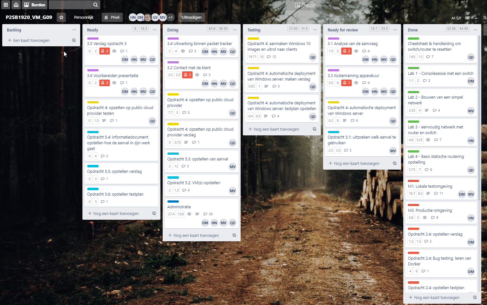
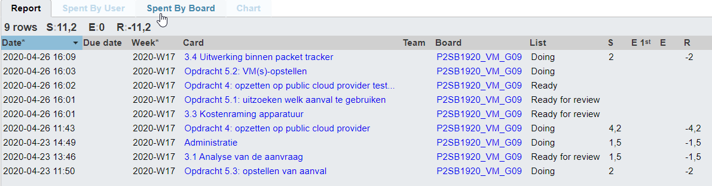
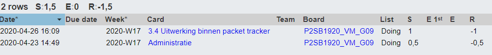
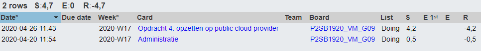
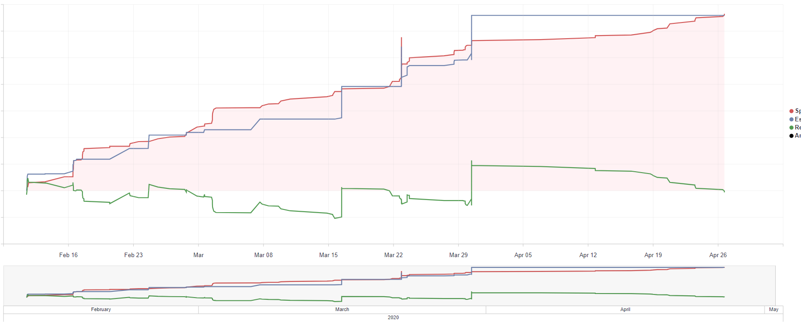

# Voortgangsrapport week 10

* Groep:09
* Datum voortgangsgesprek: 27/04/2020

| Student  | Aanw. | Opmerking |
| :---     | :---  | :---      |
| Dries |       |           |
| Nick |       |           |
| Quinten |       |           |
| Michiel |       |           |

## Wat heb je deze week gerealiseerd?

### Algemeen

* 3.1 Analyse van de aanvraag
* 3.3 Kostenraming apparatuur
* 3.4 Uitwerking binnen packet tracer
* 4 opzetten op public cloud provider
* 5.2 VM's opstellen
* 5.3 Opstellen van aanval

### Dries

* Offerte professionaliseren
* Offerte aan klant aangeboden en gecorigeerd
* Uitwerking van de offerte binnen packet tracer

### Nick

* 3.4 Uitwerking binnen packet tracer

### Quinten

* Public cloud provider voor opdracht 4 (Azure).

### Michiel

* Aanvallen voorbereiden + demonstratie voorbereiden

### Burndown

## Wat plan je volgende week te doen?

### Algemeen
* 3.4 Uitwerking binnen packet tracker
* 3.5 Verslag opdracht 3
* 5 verslag maken van aanvallen + informatiedocument
### Dries
* 3.4 Uitwerking binnen packet tracer
* Opdracht 3 afwerking
### Nick
* 3.4 Uitwerking binnen packet tracer
* 3.5 Verslag opdracht 3
### Quinten
### Michiel

## Waar hebben jullie nog problemen mee?

* ...
* ...

## Feedback technisch luik

### Algemeen

### Dries
### Nick
### Quinten
### Michiel

## Feedback analyseluik

### Algemeen

### Dries
### Nick
### Quinten
### Michiel

