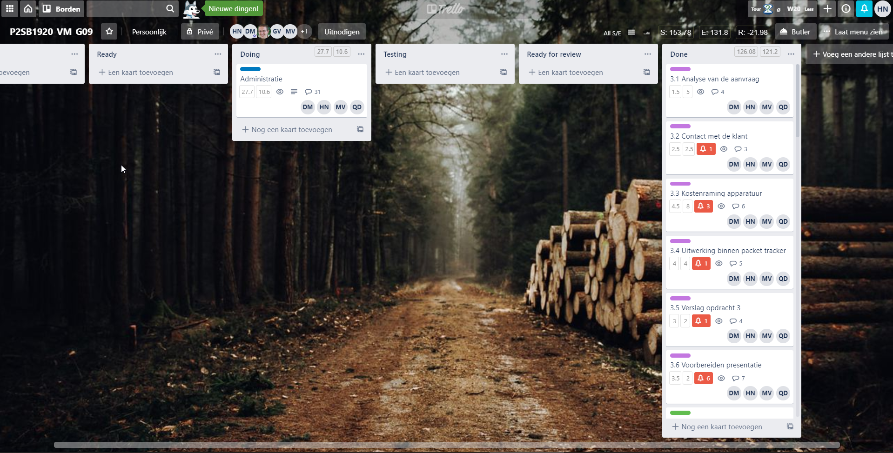
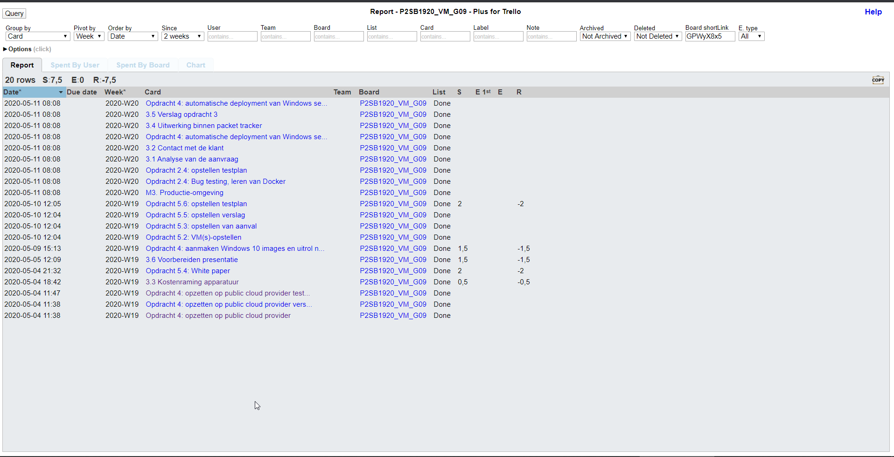
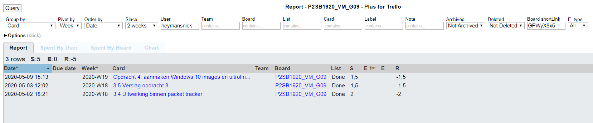
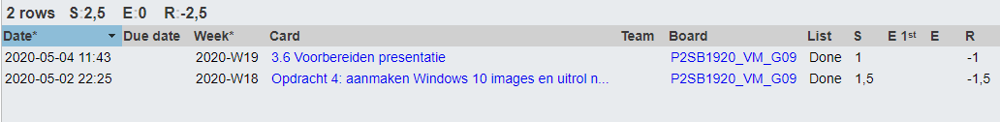
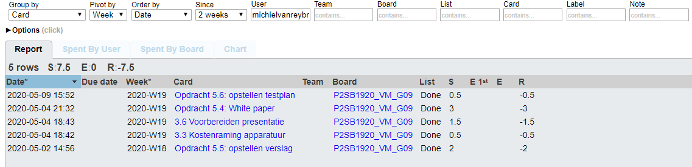

# Voortgangsrapport week 11&12

* Groep:09
* Datum voortgangsgesprek:11/04/2020

| Student  | Aanw. | Opmerking |
| :---     | :---  | :---      |
| Dries |       |           |
| Nick |       |           |
| Quinten |       |           |
| Michiel |       |           |

## Wat heb je deze weken gerealiseerd?

* Dries: Opdracht 3: Voorbereiden voorstelling, contact klant. Opdracht 5: Testing
* Nick: Opdracht 3: technische uitwerking + verslag / Opdracht 4: Uitrol client testen
* Quinten:
* Michiel: Opdracht 3: contact klant, presentatie / Opdracht 5: testplan maken, technische documentatie, white paper maken

### Algemeen

* Opdracht 3,4 en 5 afgewerkt

### Dries

* Opdracht 3: Voorbereiding voorstelling, contact met klant, aanpassingen offertes, offertes opmaak.
* Opdracht 5: Testing

### Nick

* Opdracht 3: technische uitwerking
* Opdracht 4: uitrol client testen

### Quinten

* Opdracht 3: voorbereiding voorstelling, contact met klant, offertes naar docx, presentatie 
* Opdracht 4: Screencast van client deploy

### Michiel

* Opdracht 3: contact met klant, presentatie
* Opdracht 5: testplan, technische documentatie, white paper

## Wat plan je volgende week te doen?

### Algemeen
### Dries: /
### Nick: /
### Quinten: /
### Michiel: /

## Waar hebben jullie nog problemen mee?

* ...
* ...

## Feedback technisch luik

### Algemeen

### Dries
### Nick
### Quinten
### Michiel

## Feedback analyseluik

### Algemeen

### Dries
### Nick
### Quinten
### Michiel

